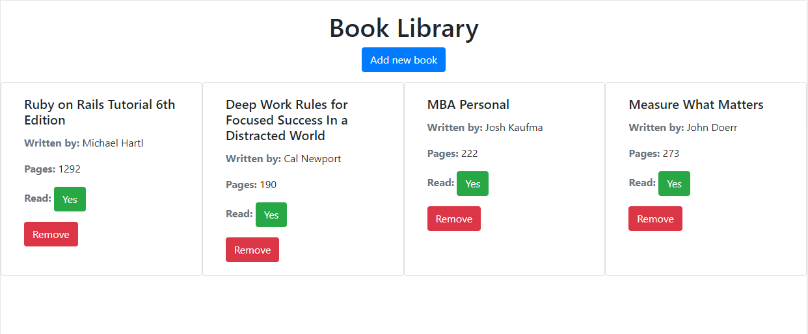

# Library

> A Javascript library app that allow users to add books with their authors and number of pages, and indicate if the user has already read it or not.




## Built With

- HTML5
- Javascript
- Bootstrap 4.5

## Getting Started

To get a local copy up and running follow these simple example steps.

### Setup

Clone the repo:

```
git clone https://github.com/abdelp/library.git
```

### Usage

Go to the root folder and open the index.html file on your browser.


## Authors

👤 **Abdel Pérez**

- Github: [@abdelp](https://github.com/abdelp)
- Twitter: [@AbdelPerez11](https://twitter.com/AbdelPerez11)
- Linkedin: [abdel-perez](https://linkedin.com/in/abdel-perez)

👤 **Elbie Moonga**

- GitHub: [@Elbie-Em](https://github.com/Elbie-em)
- Twitter: [ElbieEm](https://twitter.com/ElbieEm)
- LinkedIn: [elbie-moonga](https://www.linkedin.com/in/elbiemoonga)

## 🤝 Contributing

Contributions, issues and feature requests are welcome!

Feel free to check the [issues page](issues/).

## Show your support

Give a ⭐️ if you like this project!

## 📝 License

This project is [MIT](lic.url) licensed.